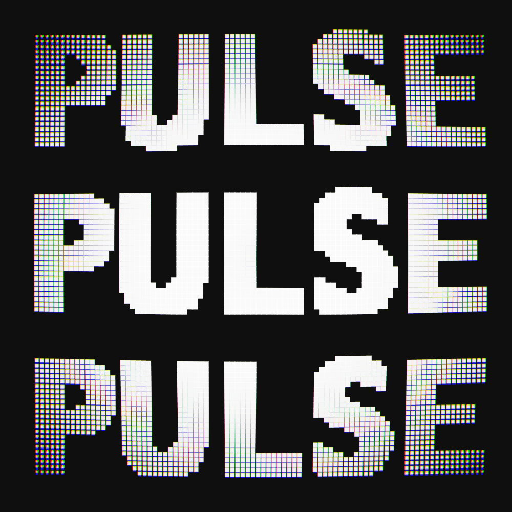
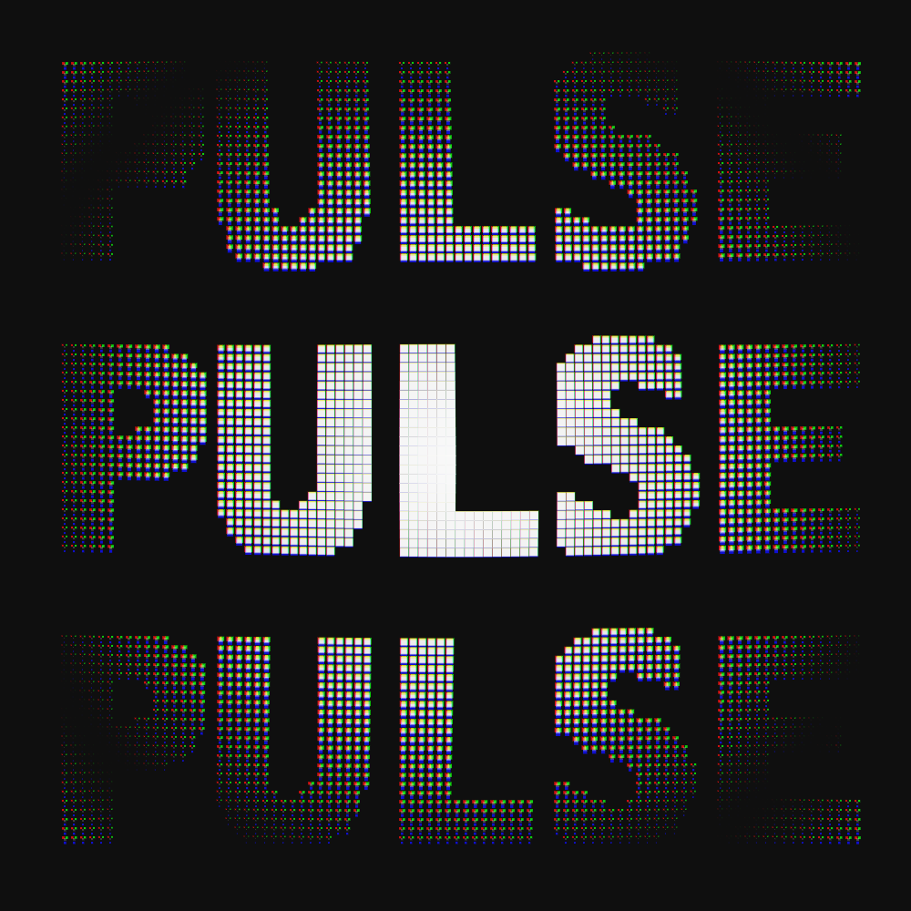
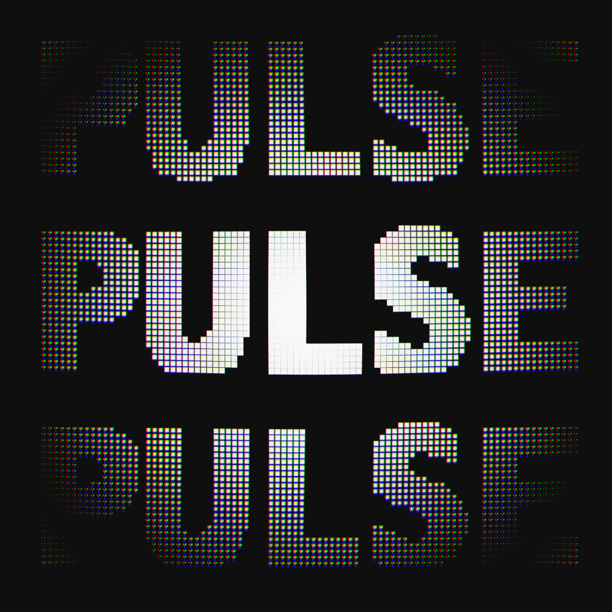

# Pulse

Lately, I have been experimenting a lot with colors (mostly white and black) mixed with text, with a sprinkle of color aberration on top.
This is one of the videos that I made a while back but never actually posted. It's been quite fun as I am really enjoying this kind of *useless, over-engineered* style of coding.

I don't know what I am not doing right but all my GIFs lately have been very big. *What am I doing wrong, FFMPEG? TELL ME!*
Anyway, you can check out a few frames here below or have a look at the rendered output on my [Instagram profile](https://www.instagram.com/lorossi).

